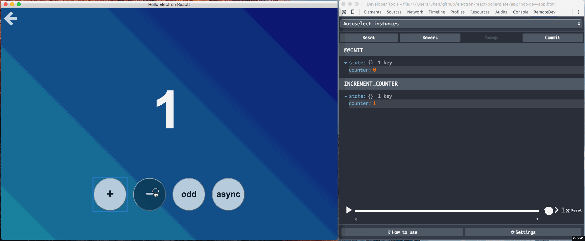

# RemoteDev Extension [](https://www.npmjs.com/package/remotedev-extension) [](https://david-dm.org/jhen0409/remotedev-extension) [](https://david-dm.org/jhen0409/remotedev-extension#info=devDependencies)

> The DevTools Extension for including remotedev-app into the Chrome/Electron DevTools



The demo is used [electron-react-boilerplate](https://github.com/chentsulin/electron-react-boilerplate).

## Why?

[Redux DevTools Extension](https://github.com/zalmoxisus/redux-devtools-extension) is awesome, but it [cannot running on Electron](https://github.com/zalmoxisus/redux-devtools-extension/issues/13). This project used [remotedev-app](https://github.com/zalmoxisus/remotedev-app), and with [remotedev](https://github.com/zalmoxisus/remotedev)/[remote-redux-devtools](https://github.com/zalmoxisus/remote-redux-devtools).

## Installation

```bash
$ npm i --save-dev remotedev-extension
```

## Usage (Chrome)

[Download Chrome Extension](https://chrome.google.com/webstore/detail/remotedev-devtools/npmkpkaejamnfodceoimeeioacfcijop)

## Usage (Electron)

```js
// app on ready
BrowserWindow.addDevToolsExtension('node_modules/remotedev-extension/dist');

// if you want remove it
BrowserWindow.removeDevToolsExtension('RemoteDev DevTools');
```

## CLI and node

```bash
$ remotedev-extension [options]
```

```js
require('remotedev-extension')(options);
```

#### Options

* --hostname: the `remotedev-server` hostname, will apply `node_modules/remotedev-extension/dist` settings.  
(default: `localhost` if `port` is set)
* --port: the `remotedev-server` port, will apply `node_modules/remotedev-extension/dist` settings.  
(default: `8000` if `runserver` or `hostname` is set)
* --runserver: start the `remotedev-server` with options on local.

## License

[MIT](LICENSE)
